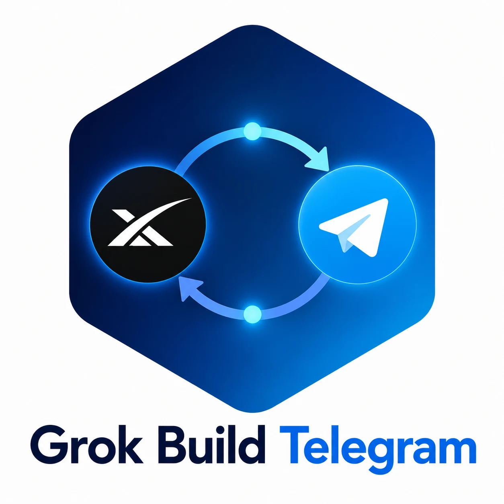

# Grok Build Telegram Bridge

<p align="center">
  
</p>

Run an xAI Grok Build coding-agent session from a private Telegram chat. The bridge uses the official [Agent Client Protocol (ACP)](https://agentclientprotocol.com) over `grok agent --model grok-build stdio`; it does not expose an inbound HTTP server or Telegram webhook.

## Features

- **Secure by default**: private chats only, one numeric Telegram owner, expiring attempt-limited pairing codes, and atomic owner-only state files.
- **Interactive permissions**: approve or reject ACP tool requests from Telegram. Permissions are never approved automatically unless `GROK_ALWAYS_APPROVE=true`.
- **Streaming responses**: throttled draft edits, ordered multi-message final responses, typing indicators, tool-progress bubbles, progress notices, and stall detection.
- **Single-poller protection**: a PID, hostname, process-start token, and heartbeat lock prevent competing bridge instances.
- **Operational visibility**: `/status` and `health.json` report session, prompt, permission, polling, and tool activity.
- **Secret isolation**: the Telegram token is not passed to the Grok subprocess, and sensitive values are redacted from permission summaries and logs.

## Requirements

- Node.js 24 or later
- A locally installed and authenticated Grok CLI with access to the `grok-build` model
- A Telegram bot token from [@BotFather](https://t.me/BotFather)

## Quick start

1. Clone the repository and install dependencies:

   ```bash
   git clone https://github.com/DanWahlin/grok-build-telegram.git
   cd grok-build-telegram
   npm install
   cp .env.example .env
   ```

2. Edit `.env`:

   ```dotenv
   TELEGRAM_BOT_TOKEN=your-bot-token
   GROK_CWD=/absolute/path/to/the/project
   ```

   `GROK_CWD` is the directory the Grok agent can inspect and modify. Use the narrowest practical project directory.

3. Start the bridge in development mode:

   ```bash
   npm run start:dev
   ```

4. Open a private chat with the bot and send a message. The one-time pairing code appears only in the bridge terminal. Send that code to the bot within five minutes.

5. Send a text prompt. The bridge keeps one persistent ACP session and processes one prompt at a time.

### Production start

Build the TypeScript output and run the compiled entry point:

```bash
npm run build
npm start
```

Run only one bridge process for a bot token. Use a process supervisor if the bridge must restart automatically.

## Telegram commands

| Command | Behavior |
| --- | --- |
| `/start`, `/help` | Show usage and pairing guidance |
| `/status` | Show bridge, ACP session, prompt, permission, and activity status |
| `/new` | Stop the current Grok subprocess and create a fresh ACP session |
| `/cancel` | Request cancellation of the active ACP prompt |

## Configuration

Copy `.env.example` to `.env`. The primary settings are:

| Variable | Default | Purpose |
| --- | --- | --- |
| `TELEGRAM_BOT_TOKEN` | Required | Token issued by @BotFather |
| `GROK_CWD` | Current directory | Working directory available to Grok |
| `GROK_BIN` | `grok` | Grok executable path; common user locations are also detected |
| `GROK_MODEL` | `grok-build` | Model passed to `grok agent` |
| `STATE_DIR` | `./.grok-telegram-state` | Directory for access, lock, and health state |
| `GROK_ALWAYS_APPROVE` | `false` | Automatically approve ACP permissions; unsafe outside a fully trusted environment |

`.env.example` documents all optional timing controls for pairing, permissions, streaming, typing, progress notices, health writes, API calls, and outbound pacing.

## How it works

```text
Private Telegram message
        |
        v
Authorization and single-prompt gate
        |
        v
Persistent ACP session over Grok stdio
        |
        +--> streamed text --> Telegram draft and final messages
        |
        +--> tool updates --> Telegram progress bubble
        |
        +--> permission request --> owner-bound approve/reject controls
```

- `grammY` long-polls Telegram. No webhook endpoint is opened.
- Prompts are serialized. A second prompt is rejected while one is active.
- Assistant output is HTML-escaped, rendered from a limited Markdown subset, and split at Telegram's message limit.
- Tool and permission controls are sent only to the authorized chat that owns the active prompt.
- Outbound Telegram operations share one paced queue with retry handling for rate limits.

## Runtime state

The bridge creates these files under `STATE_DIR`:

| File | Contents |
| --- | --- |
| `access.json` | Authorized user ID and temporary pairing state |
| `lock.json` | Single-poller ownership and heartbeat |
| `health.json` | Current bridge, Telegram, ACP, prompt, and permission status |

The state directory is forced to mode `0700` and state files to `0600`. Do not commit or share them.

## Security model and limitations

- The first successfully paired Telegram user becomes the only owner. Pairing closes after that.
- Commands, prompts, callbacks, and permission decisions are accepted only from the owner in a private chat.
- Pairing codes expire and allow at most five attempts. They are attempt-limited, not a general-purpose remote authentication system.
- The Grok subprocess receives an explicit environment allowlist and never receives `TELEGRAM_BOT_TOKEN`.
- ACP permission decisions are bound to the active request, owner, and chat.
- `GROK_ALWAYS_APPROVE=true` removes the interactive safety boundary. Leave it disabled unless the agent and working directory are fully trusted.
- The bridge forwards text and captions. Telegram media and file contents are not sent to ACP.
- One bridge supports one owner, one Grok subprocess, and one active prompt at a time.
- Use a least-privilege operating-system account and a narrowly scoped `GROK_CWD`.

## Troubleshooting

**The bot reports another poller or exits with a conflict**

Another process is using the same bot token. Stop the other process before restarting this bridge. Do not delete `lock.json` while a bridge process is still running.

**No pairing code appears in Telegram**

The code is intentionally printed only in the bridge terminal. Send any message to the bot in a private chat, then check the terminal output.

**Grok does not connect**

Confirm that `GROK_BIN` points to a working CLI, the CLI is already authenticated, `GROK_CWD` exists, and this command works locally:

```bash
grok agent --model grok-build stdio
```

**A prompt appears stalled**

Use `/status` and inspect `STATE_DIR/health.json`. The watchdog reports inactivity after `PROMPT_STALE_AFTER_MS`.

## Development

```bash
npm run typecheck
npm run lint
npm test
npm run build
npm audit
```

Run the live ACP-only smoke test when a working Grok CLI is available:

```bash
npm run smoke
```

See [`AGENTS.md`](AGENTS.md) for repository structure, security invariants, testing guidance, and contributor expectations.

## License

[MIT](LICENSE)
